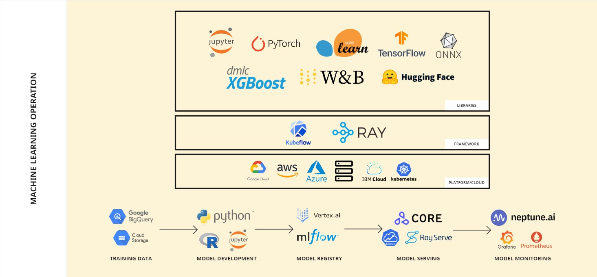

# Data and AI Platform on Google Cloud Platform

End-to-end, spanning from the ETL pipeline to the machine learning model development pipeline, all built upon Google Cloud Platform resources

## Description

This GitHub repository focuses on Data Operations using Apache Airflow for diverse data sources. The processed and tuned data is stored in Google Cloud's BigQuery for Data Warehouse capabilities or Google Cloud Storage for Data Lake purposes. Furthermore, the repository integrates Machine Learning operations using Kubeflow, deployed on Google Kubernetes Engine (GKE). The GKE setup includes Nvidia GPU nodes, providing support for CUDA for deep learning development. Additionally, the system incorporates Ray Cluster to enhance scalability and parallelism in distributed computing. To deploy and host models on the Google Cloud Platform, the workflow utilizes Google Cloud's Vertex AI, ensuring a comprehensive and scalable solution for data and machine learning workflows.

## Why Kubeflow instead of Vertex AI

Both Kubeflow and Vertex AI are platforms designed to facilitate the development and deployment of machine learning models, but they have different focuses and use cases. While Vertex AI is a managed AI/ML platform provided by Google Cloud that abstracts away many infrastructure management complexities, I opted for Kubeflow to have more robust control over the underlying infrastructure.

Additionally, despite the complexity of managing infrastructure, using Kubeflow is approximately 30% cheaper than Vertex AI:
- Training a AI/ML Model: Training a ML model using a dataset of 100GB & Machine type with 4 vCPUs and 16GB memory for 10 hours

   | Service | Cost |
   | --- | --- |
   | Vertex AI | $0.19 per hour per vCPU + $0.24 per hour per GB memory|
   | Kubeflow (GKE) | $0.10 per hour per vCPU + $0.13 per hour per GB memory|

- Serving a AI/ML Model: Serving a ML model that receives 1000 requests per second & Machine type with 2 vCPUs and 8 GB memory.

   | Service | Cost |
   | --- | --- |
   | Vertex AI | $0.29 per hour per vCPU + $0.37 per hour per GB memory|
   | Kubeflow (GKE) | $0.20 per hour per vCPU + $0.26 per hour per GB memory|

- Large Scale Data Processing: Processing 1 TB worth of data & Machine type with 8 vCPUs and 32 GB memory for 24 hours.

   | Service | Cost |
   | --- | --- |
   | Vertex AI | $0.38 per hour per vCPU + $0.48 per hour per GB memory|
   | Kubeflow (GKE) | $0.20 per hour per vCPU + $0.26 per hour per GB memory|

## Getting Started

Following these instructions will help you set up and run a project for development and testing purposes. 

### Prerequisites

* Google Cloud Platform
* [Kubeflow](https://github.com/googlecloudplatform/kubeflow-distribution) on Google Kubernetes Engine
    - Kubeflow version: 1.7.0
    - Python version: 3.8.10
* Ray Cluster (w/KubeRay Operator)

### Installation

Below are step-by-step instructions on how to copy the sample notebook in Kubeflow JupyterLab and start exploring/developing

1. Make a new notebook in the Kubeflow
2. Clone the repo
   ```sh
   git clone https://github.com/Simbamon/Data-And-AI-Platform-GCP.git
   ```
3. Install packages in the notebook
   ```sh
   !pip install '<REQUIRED_PACKAGES_FOR_THE_NOTEBOOK>'
   ```

## High-Level Architecture Diagram
### Data Operation

* Based on this [repository](https://github.com/Simbamon/Airflow_DW)
### Machine Learning Operation

## License

This project is licensed under the MIT License - see the LICENSE file for details

## Reference

* Github [fast-neural-style-pytorch by rrmina](https://github.com/rrmina/fast-neural-style-pytorch)
* Github [vertex-ai-mlops by statmike](https://github.com/statmike/vertex-ai-mlops)
* Github [fcc-intro-to-llms by Infatoshi](https://github.com/Infatoshi/fcc-intro-to-llms)
* Github [RayTutorial by ClarityCoders](https://github.com/ClarityCoders/RayTutorial/tree/master)
* Blog [Saturn Cloud](https://saturncloud.io/blog/getting-started-with-ray-clusters/)

## Issues

* Fails to delploy Kubeflow with make-apply
   - Error: `parsing time "null" as "2006-01-02T15:04:05Z07:00": cannot parse "null" as "2006"`
   - Fix: Remove `creationTimestamp: null`
   ```
   # in "kubeflow-distribution/kubeflow/apps/profiles/upstream/crd/bases/kubeflow.org_profiles.yaml"
   apiVersion: apiextensions.k8s.io/v1
   kind: CustomResourceDefinition
   metadata: # kpt-merge: /profiles.kubeflow.org
   annotations:
   controller-gen.kubebuilder.io/version: v0.8.0
   internal.kpt.dev/upstream-identifier: 'apiextensions.k8s.io|CustomResourceDefinition|default|profiles.kubeflow.org'
   creationTimestamp: null # <- Remove this line
   name: profiles.kubeflow.org
   spec:
   ...
   ```
   - Reference bug in the [Github issue](https://github.com/kubeflow/kubeflow/issues/7041)
